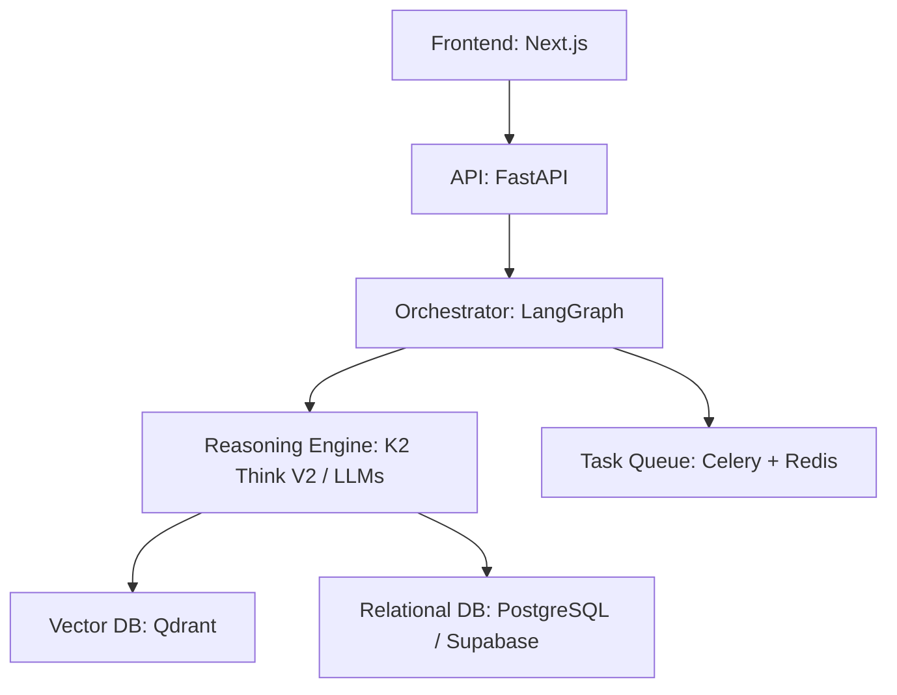

# 🧪 AI Scientific Co-Investigator: Deep Reasoning for Research

**Detect research contradictions, generate novel hypotheses, and design rigorous protocols using deep reasoning.**

Scientific research is often hindered by the massive volume of existing literature. Researchers spend up to 60% of their time searching for contradictions, identifying gaps, and designing experiments. **AI Scientific Co-Investigator** automates this pipeline using advanced reasoning models and sophisticated orchestration.

---

## 🚀 Key Features

### 🔍 1. Contradiction Detection
- Analyzes semantic meaning across multiple documents.
- Identifies conflicting findings or methodologies humans might overlook.
- Provides confidence scoring for each detected contradiction.

### 💡 2. Hypothesis Generation
- Synthesizes knowledge from disparate sources to propose novel research directions.
- Suggests unexplored intersections between different scientific fields.

### 📋 3. Protocol Design
- Generates rigorous, step-by-step experimental protocols.
- Identifies potential risks and suggests mitigation strategies.
- Optimizes resource allocation for more efficient research.

### 🛡️ 4. Self-Consistency Layer
- Employs a multi-step reasoning process (orchestrated via LangGraph).
- Generates multiple versions of analysis and independently evaluates them.
- Selects the most robust and consistent findings for the final report.

### 📜 5. Full Audit Trail
- Every decision and reasoning step is logged for transparency.
- Ensures reproducibility, a cornerstone of scientific integrity.

---

## 🛠️ Technical Architecture

The platform uses a modern, high-performance stack designed for scalability and reliability:

### Tech Stack
- **Backend:** [FastAPI](https://fastapi.tiangolo.com/) (Python)
- **Orchestration:** [LangGraph](https://www.langchain.com/langgraph)
- **Vector Search:** [Qdrant](https://qdrant.tech/) (Semantic similarity)
- **Relational Database:** [PostgreSQL](https://www.postgresql.org/) ([Supabase](https://supabase.com/))
- **Cache/Broker:** [Redis](https://redis.io/) ([Upstash](https://upstash.com/))
- **Containerization:** [Docker](https://www.docker.com/)

---

## ⚙️ Deployment

This backend is designed to run in a containerized environment (like Hugging Face Spaces or AWS).

### Prerequisites
- **Supabase**: Relational Database setup.
- **Qdrant Cloud**: Vector Database instance.
- **Upstash**: Redis instance for Celery tasks.

### Environment Variables
The following secrets are required:
- `DATABASE_URL`: Supabase connection string.
- `SECRET_KEY`: Secure random string for JWT.
- `OPENAI_API_KEY`: OpenAI (or compatible) API key.
- `QDRANT_URL` & `QDRANT_API_KEY`: Connectivity to Qdrant.
- `CELERY_BROKER_URL`: Upstash Redis URL.

---

## 📄 License

This project is licensed under the [MIT License](LICENSE).
