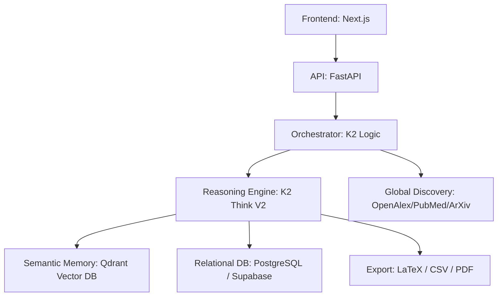

# 🧪 AI Scientific Co-Investigator: Deep Reasoning for Research

**Detect research contradictions, generate novel hypotheses, and design rigorous protocols using deep reasoning and persistent semantic memory.**

Scientific research is often hindered by the massive volume of existing literature. Researchers spend up to 60% of their time searching for contradictions, identifying gaps, and designing experiments. **AI Scientific Co-Investigator** automates this pipeline using the advanced **K2 Think V2 Engine** and sophisticated semantic orchestration.

---

## 🚀 Key Features

### 🧠 1. Long-Term Semantic Memory (New!)
- **Cross-Analysis Persistence:** The agent remembers past findings, user preferences, and methodological choices across different projects.
- **Semantic Retrieval:** Automatically queries past research context from **Qdrant** to enrich new analyses.
- **Knowledge Consolidation:** Every analysis is automatically summarized and "learned" by your co-investigator.

### 📚 2. Multi-Source Discovery Sync
- **200M+ Articles:** Real-time integration with **ArXiv, PubMed, DOAJ, and OpenAlex**.
- **Unified Search:** Search across all major scientific databases from a single interface.
- **Citation Intelligence:** Displays citation counts and impact metrics directly in search results.

### 🔍 3. Contradiction Detection
- **Multi-Document Reasoning:** Analyzes semantic meaning across multiple PDFs/Articles.
- **Conflict Identification:** Flags where Paper A disagrees with Paper B on findings or metrics.
- **Resolution Paths:** Suggests how to resolve scientific conflicts through new experiments.

### 📋 4. Protocol Design & Optimization
- **Step-by-Step Synthesis:** Generates complete experimental protocols from scratch.
- **Resource Aware:** Optimizes plans for hardware (NVIDIA GPUs), budget, and time constraints.
- **Risk Audit:** Identifies safety/ethics risks and suggests mitigation strategies.

### 🛡️ 5. Ethical & Rigorous Auditing
- **Clinical Rigor:** Built-in checks for clinical safety and academic integrity.
- **Reasoning Traces:** Full "Chain of Thought" visibility for every AI decision.
- **Grant-Ready Exports:** Export findings directly to **LaTeX** for grant proposals.

---

## 🛠️ Technical Architecture

The platform uses a state-of-the-art stack designed for "Scientific Reasoning" depth:

### Tech Stack
- **Backend:** [FastAPI](https://fastapi.tiangolo.com/) (Python)
- **AI Core:** **K2 Think V2** (Deep Reasoning API)
- **Vector Intelligence:** [Qdrant](https://qdrant.tech/) (Semantic Memory & RAG)
- **Database:** [PostgreSQL](https://www.postgresql.org/) ([Supabase](https://supabase.com/))
- **Discovery APIs:** OpenAlex, PubMed, ArXiv, DOAJ
- **Containerization:** [Docker](https://www.docker.com/)
- **Hosting:** **[Hugging Face Spaces](https://huggingface.co/spaces)**

---

## ⚙️ Deployment & Config

### Environment Variables
The following secrets are required on Hugging Face Spaces:
- `DATABASE_URL`: Supabase connection string.
- `SECRET_KEY`: Secure random string for JWT.
- `K2_THINK_API_KEY`: K2 Think V2 API key.
- `VECTOR_DB_URL` & `VECTOR_DB_API_KEY`: Connectivity to Qdrant Cloud.
- `OPENAI_API_KEY`: For semantic embeddings.
- `FRONTEND_URL`: For OAuth redirect synchronization.

---

## 📄 Ownership & License

This project is the intellectual property of **[Soumana Dama](https://www.linkedin.com/in/soumana-dama-445096253/)** ([GitHub Profile](https://github.com/Damasoumana1)). All rights reserved.
Developed for the **AI Scientific Innovation Hackathon**.
